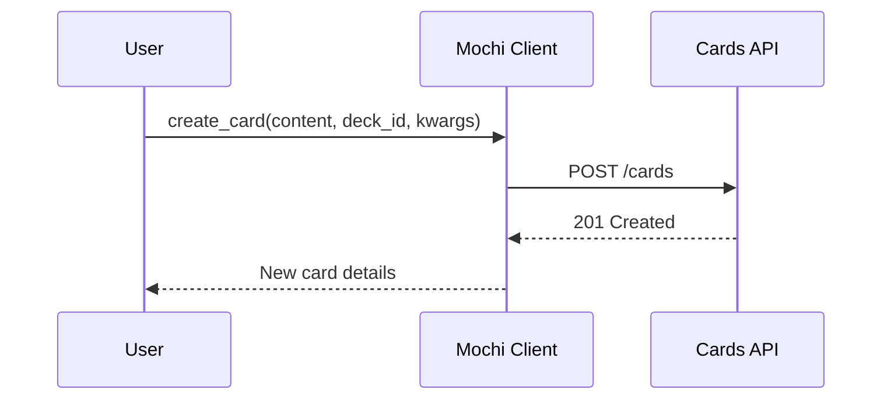
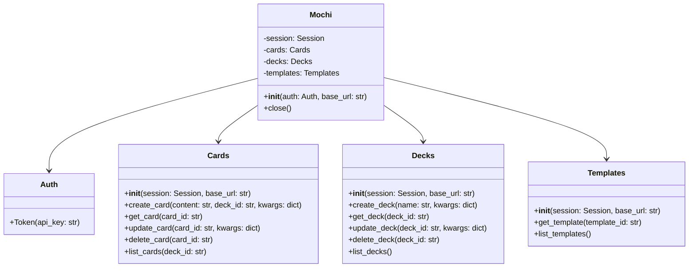

# Mochi API Client
The Mochi API Client is a Python library designed to simplify interacting with the Mochi API, allowing developers to easily create, retrieve, update, and delete cards and decks within their Python applications.

Features
- Simplified access to the Mochi API endpoints
- Methods for managing cards, decks, and templates
- Support for custom fields and attachments in cards
- Easy to integrate with Python applications

## Installation
Install the Mochi API Client using pip:

```sh
    pip install mochi-api-client
```

# Quick Start
Here's a quick example to get you started:

```python
from mochi.client import Mochi
from mochi.auth import Auth

auth = Auth.Token("find api token in mochi settings page")
mochi = Mochi(auth=auth)


# list decks
decks = mochi.decks.list_decks()
print(decks)

if len(decks) < 1:

    # Working with decks
    new_deck = mochi.decks.create_deck(name="My new deck")
    print(new_deck)

# Working with cards
new_card = mochi.cards.create_card("New card content", (decks[0])["id"])
print(new_card)

# Working with templates
templates = mochi.templates.list_templates()
print(templates)

mochi.close()
```

## Diagrams


### Sequence Diagram
A sequence diagram to show the interaction between the client and the API when creating a new card.

## Sequence Diagram for Creating a Card



## Class Diagram



## Documentation
For detailed documentation on all available methods and their parameters, visit Mochi API Documentation.

## Contributing
Contributions are welcome! Please read our Contributing Guide for details on how to submit pull requests, report issues, and suggest improvements.

## License
This project is licensed under the MIT License - see the LICENSE file for details.

## Support
If you encounter any problems or have suggestions, please file an issue on the GitHub issue tracker.